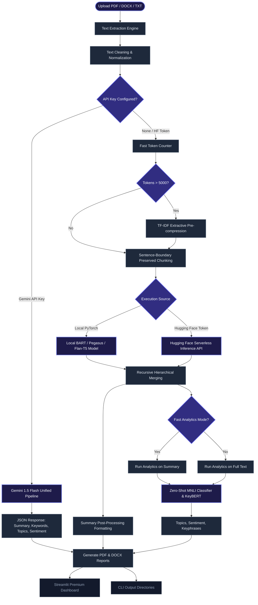

# Briefly.AI - Intelligent Document Summarization & Analytics Platform

Briefly.AI is an end-to-end, high-performance Natural Language Processing (NLP) application that extracts text from multiple document formats, generates abstractive summaries using hierarchical transformer pipelines, and performs semantic analytics (zero-shot topic detection, sentiment analysis, and keyword extraction). 

The platform features both a premium interactive Web Dashboard built with Streamlit and a scalable, multi-threaded Command Line Interface (CLI) for batch document processing.

---

## 🏗️ System Architecture & Workflow

The platform handles document processing through a structured pipeline that ensures both massive documents (50+ pages) and resource-constrained environments (like Streamlit Cloud) are accommodated without out-of-memory (OOM) crashes or excessive execution latency.



### Architectural Pipeline Breakdown
1. **Extraction**: [extract_text_from_pdf](file:///d:/summariser/utils.py#L6) and [extract_text_from_docx](file:///d:/summariser/utils.py#L27) lazily load PyMuPDF and `python-docx` to extract text from files. Text files are parsed via [extract_text_from_txt](file:///d:/summariser/utils.py#L57) using fallback encoding schemas (UTF-8, Latin-1, CP1252).
2. **Text Cleaning**: [clean_text](file:///d:/summariser/utils.py#L70) repairs PDF hyphen-breaks, strips trailing spacing, and normalizes consecutive newline gaps into clean paragraph blocks.
3. **Extractive pre-compression (TF-IDF)**: For documents containing over 5,000 estimated tokens, a fast extractive TF-IDF sentence ranker scores and extracts the most informative ~150 sentences. This reduces massive documents down to the key content blocks in under 2 seconds, preventing downstream transformer overload.
4. **Sentence-boundary Preserved Chunking**: Documents are split into segments of at most 1,024 tokens without cutting sentences in half.
5. **Abstractive Core**: Chunks are processed via local Hugging Face pipelines (`transformers`), remote Hugging Face Serverless APIs, or Google Gemini 1.5 Flash.
6. **Hierarchical Recursive Merging**: Chunk summaries are concatenated and recursively summarized if the merged text exceeds 1,024 tokens.
7. **Downstream NLP Analytics**:
   - **Zero-Shot Topic Classification**: Maps text onto a customized set of target categories using MNLI models.
   - **Zero-Shot Sentiment Analysis**: Evaluates overall emotional tone (Positive, Negative, Neutral).
   - **Keyphrase Extraction**: Pinpoints primary document keywords using KeyBERT (supported by sentence-transformers).
8. **Export Hub**: Generated summaries are exported to Word (.docx) via `python-docx` and print-ready PDF reports via `FPDF2` complete with embedded metadata, key stats, and keywords.

---

## ⚡ Execution Modes

The platform supports three distinct execution pathways, configurable via the dashboard sidebar or CLI flags:

### 1. Google Gemini Cloud Mode (Recommended)
- **Requirements**: Google Gemini API Key.
- **Benefits**: Runs remotely on `gemini-1.5-flash`. Supports massive contexts, finishes the entire pipeline (summarization, keyword extraction, topic detection, and sentiment analysis) in **under 1.5 seconds**, and consumes **0 MB of local memory (RAM/VRAM)**.

### 2. Hugging Face Serverless Mode
- **Requirements**: Hugging Face User Access Token (`hf_...`).
- **Benefits**: Offloads abstractive summarization and zero-shot classification to Hugging Face's remote servers. Performs runs in **under 4 seconds** with minimal local hardware requirements.

### 3. Local PyTorch Mode
- **Requirements**: PyTorch and model weights downloaded locally.
- **Benefits**: Fully offline execution. Automatically maps processing to CUDA GPUs if available; otherwise falls back to local CPU execution. 
- *Note:* Large models can be extremely resource intensive on local CPUs and may trigger OOM errors on limited-resource hosting environments.

---

## 🌟 Key Features & Customizations

- **Summary Formatting Modes**:
  - `Executive Summary`: Balanced, cohesive paragraph outputs.
  - `Bullet Point Summary`: Bullet-indexed key statements.
  - `Detailed Summary`: Comprehensive, in-depth text layout.
  - `Meeting Notes Summary`: Structured into *Key Discussions*, *Decisions Reached*, and *Action Items* using zero-shot classification over generated summary sentences.
  - `Research Paper Summary`: Formatted into *Objectives & Scope*, *Methodology*, *Key Findings*, and *Conclusions*.
  - `Key Insights Summary`: Key insights indexed with distinctive emoji indicators.
- **Flexible Length Settings**: Toggle output target sizes between `short`, `medium`, and `long`.
- **Advanced Generation Settings**: Fine-tune Temperature, Length Penalties, and Beam Search.
- **Low-Resource Switch**: Toggle resource modes on the sidebar to instantly switch zero-shot classifiers (e.g. from `facebook/bart-large-mnli` down to the lighter `valhalla/distilbart-mnli-12-6`) to run cleanly on lightweight server setups.

---

## 📂 Project Structure

- [app.py](file:///d:/summariser/app.py): The main Streamlit interactive web dashboard. Implements styling, handles state, renders charts (Plotly), and controls batch file processing.
- [summarizer.py](file:///d:/summariser/summarizer.py): Contains the core [DocumentSummarizerPipeline](file:///d:/summariser/summarizer.py#L54) class which coordinates local/remote transformer pipelines, TF-IDF compression, chunking, and semantic formatting.
- [utils.py](file:///d:/summariser/utils.py): Utility functions for text extraction (PDF, DOCX, TXT), document statistics, PDF rendering via FPDF2, and MS Word document export.
- [cli_pipeline.py](file:///d:/summariser/cli_pipeline.py): The CLI processing engine. Houses the [process_single_file](file:///d:/summariser/cli_pipeline.py#L20) batch routine.
- [requirements.txt](file:///d:/summariser/requirements.txt): Declares project dependencies.

---

## 🛠️ Installation & Setup

1. **Verify Python Installation**: Ensure Python 3.9, 3.10, or 3.11 is active on your system.
2. **Create and Activate a Virtual Environment**:
   ```bash
   python -m venv venv
   
   # Activation on Windows (PowerShell)
   .\venv\Scripts\Activate.ps1
   # Activation on Windows (Command Prompt)
   .\venv\Scripts\activate
   # Activation on macOS/Linux
   source venv/bin/activate
   ```
3. **Install Dependencies**:
   ```bash
   pip install -r requirements.txt
   ```

---

## 🚀 Running the Web Dashboard (Streamlit)

Launch the interactive web portal by running:
```bash
streamlit run app.py
```
Open your browser and navigate to `http://localhost:8501`. 

---

## 💻 Command Line Interface (CLI) Reference

The CLI pipeline ([cli_pipeline.py](file:///d:/summariser/cli_pipeline.py)) handles batch directory processing. It runs in parallel threads when remote APIs are active and runs sequentially in local mode to protect CPU/GPU resource constraints.

### Argument Glossary

| Argument | Shortcut | Default | Description |
| :--- | :--- | :--- | :--- |
| `--input` | `-i` | *(Required)* | Path to the directory containing `.pdf`, `.docx`, and `.txt` files |
| `--output` | `-o` | *(Required)* | Directory where output `.txt`, `.docx`, `.pdf`, and `.json` reports are saved |
| `--gemini-key` | - | `None` | Google Gemini API Key for fast, remote 1.5 Flash processing |
| `--hf-token` | - | `None` | Hugging Face Access Token for remote Serverless Inference |
| `--model` | `-m` | `sshleifer/distilbart-cnn-12-6` | Hugging Face abstractive summarizer model name |
| `--classifier-model`| - | `valhalla/distilbart-mnli-12-6` | Hugging Face zero-shot MNLI classifier |
| `--mode` | - | `Executive Summary` | Structured summary format (`Executive Summary`, `Bullet Point Summary`, `Detailed Summary`, `Meeting Notes Summary`, `Research Paper Summary`, `Key Insights Summary`) |
| `--length` | - | `medium` | Target length setting (`short`, `medium`, `long`) |
| `--temperature` | - | `0.7` | Sampling temperature for generative models |
| `--beams` | - | `4` | Number of beams for beam search |
| `--length-penalty` | - | `2.0` | Length penalty configuration |
| `--fast` | - | `True` | Run zero-shot analytics on the summary instead of full text (10x speedup) |
| `--concurrency` | `-c` | `4` | Number of parallel worker threads when using remote APIs |
| `--topics` | - | *(Standard List)* | Comma-separated list of candidate topics for classification |

### Copy-Pasteable Command Examples

#### 1. Local Offline Mode
Run on the local CPU or GPU using the default DistilBART model:
```bash
python cli_pipeline.py --input ./input_docs --output ./outputs --mode "Bullet Point Summary" --length short
```

#### 2. Google Gemini API Mode (High Speed, Zero RAM)
Process documents in parallel using the Gemini 1.5 Flash API:
```bash
python cli_pipeline.py --input ./input_docs --output ./outputs --gemini-key "YOUR_GEMINI_API_KEY" --mode "Key Insights Summary" --length long --concurrency 6
```

#### 3. Hugging Face Serverless Mode
Offload the abstractive summarization onto Hugging Face cloud endpoints:
```bash
python cli_pipeline.py --input ./input_docs --output ./outputs --hf-token "YOUR_HF_API_TOKEN" --model "facebook/bart-large-cnn" --mode "Research Paper Summary"
```

### Outputs Generated
For each processed document `doc_name.ext`, the output folder will contain:
- `summary_doc_name.txt`: Raw markdown summary text.
- `summary_doc_name.docx`: Formatted Microsoft Word document.
- `summary_doc_name.pdf`: Structured PDF summary document complete with metadata tables.
- `analytics_doc_name.json`: Full metadata file listing word counts, volume reduction %, processing latency, keywords (with weights), topic classification scores, and sentiment probabilities.
- `batch_processing_report.csv`: An aggregated index tracking performance details of all processed files.

---

## 👥 Contributors & Roles

### Edupulapati Sai Praneeth (NLP Engineer & Backend Developer)

* Developed the NLP pipeline for document summarization, keyword extraction, topic detection, and sentiment analysis.
* Built document processing modules, including text extraction, hierarchical chunking, and AI model integration.

### Pasam Sesha Srinivasa Sanjana (Full-Stack Developer & System Architect)

* Developed the interactive Streamlit dashboard with analytics visualizations and user-focused features.
* Designed the application architecture and implemented backend integrations for seamless end-to-end functionality.
